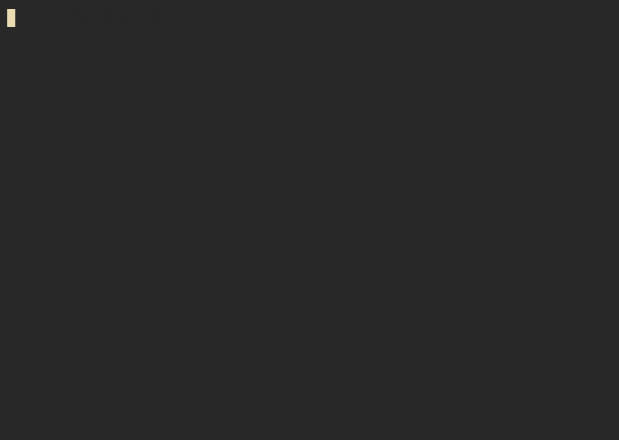

# The typical Pyramid program example

I relized you could easily do the pyramid example using formatting
specifiers like Rust's [`fmt`](https://doc.rust-lang.org/std/fmt/)
module or Python's f-strings.

This is my simple proof of concept in Rust.

## Example

Here are two recordings of the program:

On [asciinema.org] (you can select text directly):

As a GIF:

## Extra

The repo contains the `cast` files as well if you'd like to regenerate
the recording yourself.
